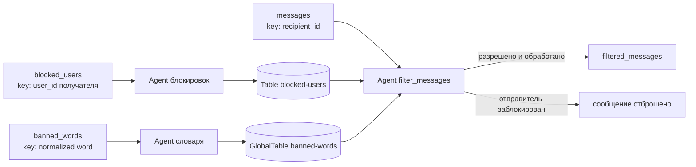

# Практическая работа 3: потоковая фильтрация сообщений

Учебный проект на Python для [первого задания практической работы](practical_work_3.md) второго модуля курса по Kafka.

Приложение демонстрирует:

- асинхронную потоковую обработку с `faust-streaming`;
- отдельный список заблокированных отправителей для каждого получателя;
- сохранение состояния в Faust `Table` и восстановление из Kafka changelog;
- глобальный динамически обновляемый список запрещённых слов;
- маскирование целых слов перед публикацией сообщения получателю;
- запуск локально через `uv` и целиком в Docker Compose;
- Typer CLI для запуска worker-а и отправки тестовых событий.

Автотесты в проект не добавлены по условию работы. Ниже приведён воспроизводимый ручной сценарий проверки.

## Как работает приложение



Управляющие события и сообщения обрабатываются разными Kafka-топиками, поэтому изменения применяются асинхронно. Перед
отправкой проверочного сообщения дождитесь в логах worker-а записи об обновлении соответствующей таблицы.

### Модели событий

`messages` и `filtered_messages` используют одинаковую JSON-схему:

```json
{
  "user_id": "carol",
  "recipient_id": "alice",
  "message": "Kafka полезна",
  "timestamp": 1788624000000
}
```

`timestamp` — Unix timestamp в миллисекундах. Kafka key всегда равен `recipient_id`: сообщения получателя и его список
блокировок попадают в одну партицию и обрабатываются одним shard-ом Faust.

Событие `blocked_users`:

```json
{
  "user_id": "alice",
  "blocked_user_id": "bob",
  "action": "block"
}
```

Допустимые действия: `block` и `unblock`. Kafka key равен `user_id` владельца списка.

Событие `banned_words`:

```json
{
  "word": "kafka",
  "action": "ban"
}
```

Допустимые действия: `ban` и `allow`. Слово и Kafka key нормализуются через `strip().casefold()`.

Цензура не зависит от регистра и заменяет каждый символ целого совпавшего слова на `*`. Например,
`Kafka полезна` превращается в `***** полезна`, но слово `kafkagram` не изменяется.

## Структура проекта

```text
.
├── Dockerfile
├── docker-compose.yml
├── practical_work_3.md
├── pyproject.toml
├── uv.lock
├── .pre-commit-config.yaml
└── src/
    └── kafka_app/
        ├── __init__.py
        ├── censor.py
        ├── cli.py
        ├── config.py
        ├── faust_app.py
        ├── models.py
        └── producer.py
```

Возможное второе задание с ksqlDB не реализовано. Схема `messages` уже содержит требуемые для него поля. SQL-запросы
будут добавлены позднее в `ksqldb/ksqldb-queries.sql`, а текущий Compose можно расширить сервисами ksqlDB.

## Требования

- Docker и Docker Compose v2;
- `uv`;
- свободные порты `8080`, `19092`, `29092`, `39092`.

Проект использует Python 3.14. Все зависимости и Python-команды запускаются через `uv`; отдельно вызывать `pip` или
системный интерпретатор не требуется.

## Makefile

Основные команды собраны в `Makefile`. Полный список можно вывести так:

```bash
make help
```

Установить зависимости и выполнить проверки качества кода:

```bash
make install
make check
```

Запустить Kafka локально в Docker, а worker — в текущем терминале:

```bash
make infra-up
make local-worker
```

Или собрать и запустить весь стек, включая worker, в Docker Compose:

```bash
make compose-up
make logs
```

Публиковать события можно отдельными командами. По умолчанию используется сценарий из README (`alice`, `bob`,
`kafka`), параметры переопределяются переменными Make:

```bash
make block-user OWNER_ID=alice BLOCKED_USER_ID=bob
make ban-word WORD=kafka
make send-message SENDER_ID=carol RECIPIENT_ID=alice MESSAGE="Kafka полезна"
```

Если worker запущен в Compose, используйте Docker-варианты:

```bash
make docker-block-user OWNER_ID=alice BLOCKED_USER_ID=bob
make docker-ban-word WORD=kafka
make docker-send-message SENDER_ID=carol RECIPIENT_ID=alice MESSAGE="Kafka полезна"
```

Готовый демонстрационный сценарий отправляет блокировку, запрещённое слово и три сообщения; результат читается так:

```bash
make scenario-docker
make consume-filtered MAX_MESSAGES=2
```

Для локального worker-а вместо `scenario-docker` используйте `scenario-local`. Управление стеком: `make ps`,
`make restart`, `make compose-down`, а для полного сброса Kafka volumes — `make compose-clean`.

## Установка зависимостей и качество кода

```bash
uv sync --all-groups
```

Проверка линтером и форматтером Ruff:

```bash
uv run ruff check .
uv run ruff format --check .
```

Установка и ручной запуск git hook-ов:

```bash
uv run pre-commit install
uv run pre-commit run --all-files
```

Справка Typer CLI:

```bash
uv run kafka-app --help
uv run kafka-app worker --help
uv run kafka-app send-message --help
uv run kafka-app block-user --help
uv run kafka-app ban-word --help
```

## Kafka-кластер

[Docker Compose](docker-compose.yml) разворачивает три брокера Kafka в режиме KRaft и Kafka UI. Каждый узел выполняет
роли broker и controller. Конфигурация предназначена для локального обучения: listeners используют `PLAINTEXT`.

Запустить только Kafka, UI и создать прикладные топики:

```bash
docker compose up -d kafka-1 kafka-2 kafka-3 kafka-ui
docker compose run --rm kafka-init
docker compose ps --all
```

Дождитесь состояния `healthy` у всех трёх брокеров. Kafka UI доступен по адресу <http://localhost:8080>.

Адреса Kafka:

```text
Из host-машины: kafka://localhost:19092;localhost:29092;localhost:39092
Из Compose-сети: kafka://kafka-1:9092;kafka-2:9092;kafka-3:9092
```

> Про формат адресов можно глянуть [тут](https://faust-streaming.github.io/faust/userguide/settings.html)

Проверка доступности кластера:

```bash
docker compose exec kafka-1 kafka-broker-api-versions \
  --bootstrap-server kafka-1:9092
```

## Топики

Сервис `kafka-init` идемпотентно создаёт внешние топики:

| Топик               | Партиции | Назначение                                       |
|---------------------|----------|--------------------------------------------------|
| `messages`          | 3        | Входящие сообщения                               |
| `filtered_messages` | 3        | Разрешённые сообщения после цензуры              |
| `blocked_users`     | 3        | Команды изменения блокировок                     |
| `banned_words`      | 1        | Команды изменения небольшого глобального словаря |

Replication factor всех топиков равен `3`. Одинаковые три партиции `messages`, `blocked_users` и changelog таблицы
блокировок обеспечивают совместное партиционирование по получателю. Для `GlobalTable` словаря используется одна партиция
и минимальный recovery buffer — рекомендуемая Faust конфигурация для надёжного глобального восстановления.

Описать прикладные топики:

```bash
for topic in messages filtered_messages blocked_users banned_words; do
  docker compose exec kafka-1 kafka-topics \
    --bootstrap-server kafka-1:9092 \
    --describe \
    --topic "$topic"
done
```

Faust самостоятельно создаёт внутренние служебные и changelog-топики. Показать их можно так:

```bash
docker compose exec kafka-1 kafka-topics \
  --bootstrap-server kafka-1:9092 \
  --list
```

## Запуск всего приложения в Docker

Собрать образ и запустить кластер, Kafka UI, инициализацию топиков и Faust worker:

```bash
docker compose up -d --build
docker compose ps --all
```

Одноразовый контейнер `kafka-init` должен завершиться с кодом `0`, а `stream-processor` — остаться запущенным.

Логи обработки:

```bash
docker compose logs -f stream-processor
```

Typer-команды для тестовых событий можно выполнять внутри запущенного контейнера приложения:

```bash
docker compose exec stream-processor uv run --frozen --no-dev --no-sync kafka-app block-user alice bob
docker compose exec stream-processor uv run --frozen --no-dev --no-sync kafka-app ban-word kafka
docker compose exec stream-processor uv run --frozen --no-dev --no-sync kafka-app send-message bob alice "Сообщение от заблокированного пользователя"
docker compose exec stream-processor uv run --frozen --no-dev --no-sync kafka-app send-message carol alice "Kafka полезна"
docker compose exec stream-processor uv run --frozen --no-dev --no-sync kafka-app send-message dave alice "kafkagram остаётся без изменений"
```

Compose подставит внутренние адреса брокеров через `KAFKA_BROKERS`.

## Запуск worker-а локально через uv

Сначала запустите Kafka и создайте топики, затем в первом терминале:

```bash
uv run kafka-app worker --log-level INFO
```

Во втором терминале отправьте управляющие события:

```bash
uv run kafka-app block-user alice bob
uv run kafka-app ban-word kafka
```

После появления в логах worker-а строк об обновлении таблиц отправьте три сообщения:

```bash
uv run kafka-app send-message bob alice "Сообщение от заблокированного пользователя"
uv run kafka-app send-message carol alice "Kafka полезна"
uv run kafka-app send-message dave alice "kafkagram остаётся без изменений"
```

Worker работает до `Ctrl+C`, остальные команды отправляют одно событие и завершаются.

Подключение настраивается переменными окружения:

| Переменная      | По умолчанию                                              | Назначение              |
|-----------------|-----------------------------------------------------------|-------------------------|
| `KAFKA_BROKERS` | `kafka://localhost:19092;localhost:29092;localhost:39092` | Bootstrap brokers Faust |
| `FAUST_STORE`   | `memory://`                                               | Локальный Table store   |

Например:

```bash
KAFKA_BROKERS='kafka://localhost:19092' uv run kafka-app worker
```

## Проверка результата

На чистом стенде в `filtered_messages` должны появиться ровно два сообщения из трёх:

- сообщение `bob → alice` отсутствует, потому что `alice` заблокировала `bob`;
- сообщение `carol → alice` содержит `***** полезна`;
- сообщение `dave → alice` не изменилось, потому что запрещённое слово не является отдельным.

Прочитать два ожидаемых результата:

```bash
docker compose exec kafka-1 kafka-console-consumer \
  --bootstrap-server kafka-1:9092 \
  --topic filtered_messages \
  --from-beginning \
  --max-messages 2 \
  --formatter-property print.key=true \
  --formatter-property key.separator=" | "
```

Проверить динамическое снятие ограничений:

```bash
uv run kafka-app unblock-user alice bob
uv run kafka-app allow-word kafka
```

Дождитесь применения обновлений и отправьте ещё одно сообщение:

```bash
uv run kafka-app send-message bob alice "Kafka снова разрешена"
```

Новое сообщение должно попасть в `filtered_messages` без маскирования.

### Отправка сырого JSON через Kafka CLI

Для ручной проверки без Typer важно передавать ключ и JSON через разделитель `|`:

```bash
docker compose exec -T kafka-1 kafka-console-producer \
  --bootstrap-server kafka-1:9092 \
  --topic blocked_users \
  --property parse.key=true \
  --property key.separator='|' <<'EOF'
alice|{"user_id":"alice","blocked_user_id":"bob","action":"block"}
EOF
```

```bash
docker compose exec -T kafka-1 kafka-console-producer \
  --bootstrap-server kafka-1:9092 \
  --topic banned_words \
  --property parse.key=true \
  --property key.separator='|' <<'EOF'
kafka|{"word":"kafka","action":"ban"}
EOF
```

```bash
docker compose exec -T kafka-1 kafka-console-producer \
  --bootstrap-server kafka-1:9092 \
  --topic messages \
  --property parse.key=true \
  --property key.separator='|' <<'EOF'
alice|{"user_id":"carol","recipient_id":"alice","message":"Kafka полезна","timestamp":1788624000000}
EOF
```

### Проверка Consumer Group и восстановления состояния

Consumer group Faust совпадает с application id `message-filter`:

```bash
docker compose exec kafka-1 kafka-consumer-groups \
  --bootstrap-server kafka-1:9092 \
  --describe \
  --group message-filter
```

Локальный store настроен как `memory://`: при перезапуске процесса память очищается, но Faust восстанавливает обе
таблицы из внутренних Kafka changelog-топиков. Проверить это можно без удаления volumes:

```bash
docker compose restart stream-processor
docker compose logs -f stream-processor
```

После завершения recovery повторно отправьте сообщение от заблокированного пользователя и сообщение с запрещённым
словом. Правила должны сохраниться.

## Как выполнены требования задания

### Блокировка пользователей

Агент `update_blocked_users` читает `blocked_users` и хранит для каждого `user_id` отдельный сериализуемый список в
`blocked-users` Table. При обновлении создаётся новый объект состояния и присваивается таблице, поэтому Faust записывает
изменение в changelog. Агент `filter_messages` читает этот shard по ключу получателя и не публикует заблокированные
сообщения.

### Цензура

Агент `update_banned_words` обновляет `banned-words` GlobalTable. Каждый worker получает полный небольшой словарь. Перед
отправкой разрешённого сообщения агент строит список активных слов и маскирует целые совпадения без учёта регистра.
Результат с исходными `user_id`, `recipient_id` и `timestamp` записывается в `filtered_messages`.

## Очистка

Остановить контейнеры, сохранив Kafka volumes:

```bash
docker compose down
```

Удалить контейнеры, топики, offsets и changelog-состояние:

```bash
docker compose down -v
```

После `down -v` повторная проверка начинается с чистого состояния.
